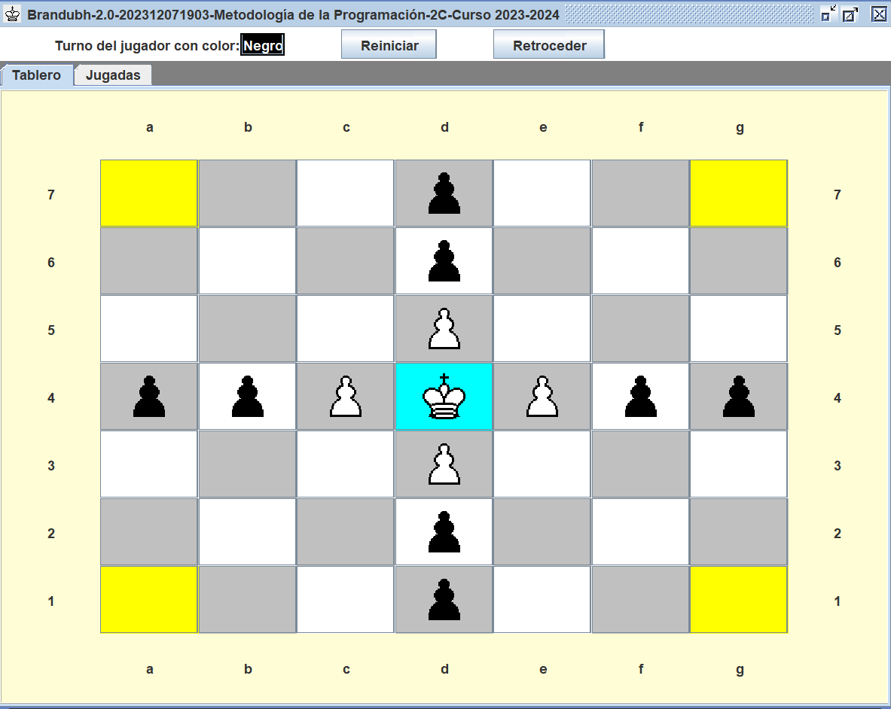
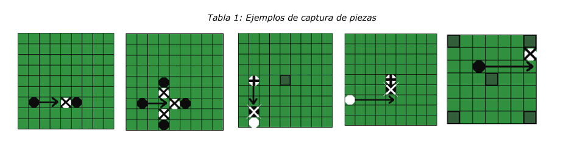
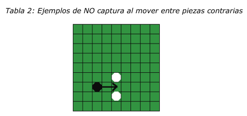

# PROYECTO JUEGO BRANDUBH
Este proyecto lo he desarrollado en el marco de la asignatura de segundo curso del Grado, Metodología de la programación, [**Universidad de Burgos**](https://www.ubu.es/grado-en-ingenieria-informatica) (UBU).
He trabajado en la implementación del juego de mesa de origen vikingo Brandubh.El objetivo principal era crear un videojuego utilizando el lenguaje de programación Java y el entorno de desarrollo Eclipse.
El proyecto se ejecuta en modo texto y tambien con una interfaz gráfica aportada por el profesor de esta asignatura Raúl Marticorena Sanchez.

# Como jugar y reglas del juego 

El Brandubh es un juego compuesto por un tablero de 7x7 celdas, para dos contrincantes: con 5 piezas de color blanco para el defensor y 8 piezas de color negro para el atacante.

La colocación inicial de las piezas se muestra a continuación en la Ilustración:

Existe una pieza especial de color blanco, el rey que se coloca inicialmente en la celda central deno
minada trono. Las celdas en las esquinas tienen un rol especial, y se denominarán provincias, remar
cándose con un color diferente.

 ## Los objetivos para ganar la partida son diferentes para cada contrincante:
 
 • Las piezas defensoras (piezas blancas) deben conseguir que el rey llegue a colocarse en una
 de las cuatro provincias.
 
 • Las piezas atacantes (piezas negras) deben conseguir capturar al rey, antes de que escape
 a una provincia.
 
 ## Reglas:
 1.En cada turno los jugadores podrán mover solo una de sus piezas a una celda libre del tablero. 
 2.Los movimientos solo pueden ser en horizontal y vertical, y a cualquier distancia dentro de las
 dimensiones de tablero (similar a los movimientos de una torre en el ajedrez). 
 3.No pueden saltar por encima de ninguna otra pieza, sea cual sea su color. Y salvo el rey, el resto de piezas NO pueden
 ocupar las provincias.
 4.Se pueden capturar piezas, cuando al mover una pieza, una pieza del contrincante queda atrapada
 horizontal o verticalmente entre dos piezas del turno que acaba de mover. 
 5.Es posible capturar másde una pieza en un solo movimiento, tomando en consideración cada sentido (norte, sur, este u oeste).
 6.Las provincias cuentan como piezas contrarias para resolver capturas y el rey también puede usarse
 para capturar piezas del atacante. 
 7.Las piezas capturadas seran eliminadas del tablero tras elmovimiento, a excepción del rey. 
 
 En la siguiente Tabla 1 se muestran ejemplos de capturas.El rey se representa con una cruz, mientras que la pieza o piezas eliminadas se
 marcan con un aspa:
 
 ### Ejemplos de captura de piezas
 
 
 
 Sin embargo, una pieza puede mover entre dos piezas contrarias, no siendo capturada como se muestran
 en:
 ### Ejemplos de NO captura al mover entre piezas contrarias
 
  
  
 El rey situado en el trono solo puede ser capturado si está rodeado de cuatro piezas contrarias. Si está colindante al trono, puede ser capturado por tres piezas contrarias.
 En el resto de posiciones del tablero, se aplica la regla general de captura.

  
 
 8.Una vez abandonado el trono por el rey, el resto de piezas pueden pasar por encima, pero no  pueden
 dejar su pieza en el trono. El rey sí puede volver a ocupar el trono. 
 
 9.El trono abandonado se utiliza igual que las provincias para las capturas de piezas, jugando el rol de
 pieza contraria (a excepción del caso especial con el rey ya mencionado).
 
10.siempre comienza la partida el contrincante atacante con turno negro
